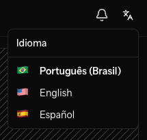
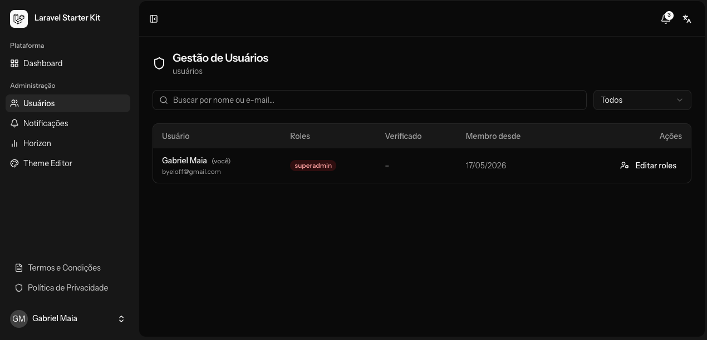
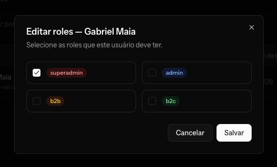
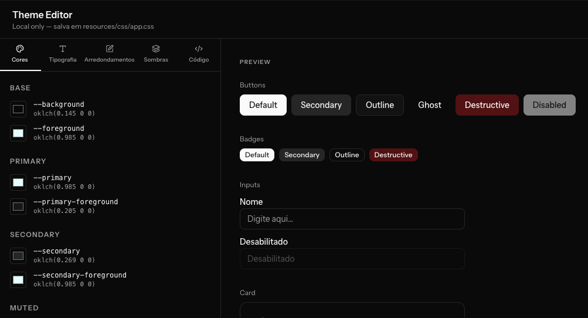
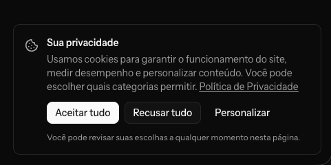
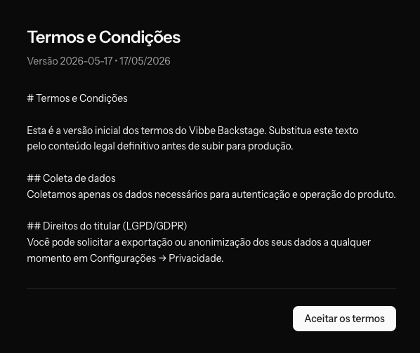
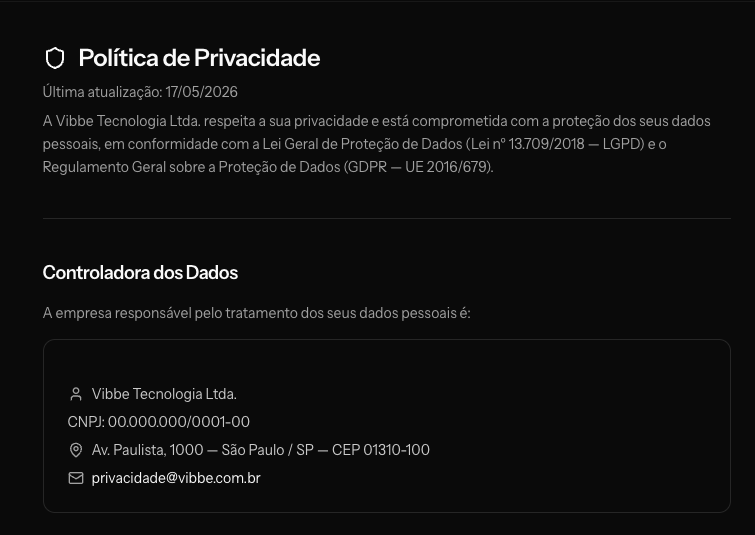
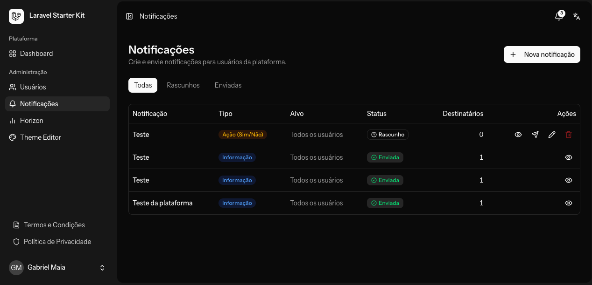
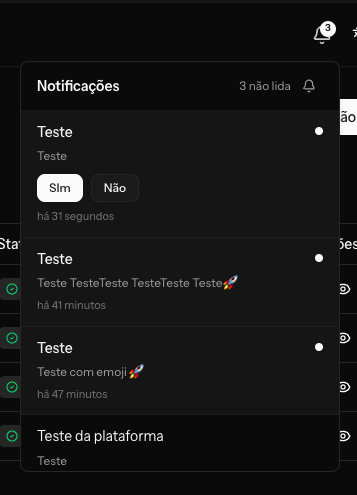
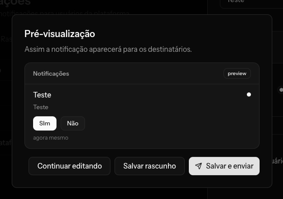

<p align="center">
  
</p>

<p align="center">
  <strong>Laravel + Inertia + React starter kit. Production-ready in one command.</strong>
</p>

<p align="center">
  <a href="https://packagist.org/packages/byeloff/thronekit"></a>
  <a href="https://packagist.org/packages/byeloff/thronekit"></a>
  
  
  
  
  
  <a href="LICENSE"></a>
</p>

---

ThroneKit drops a complete full-stack foundation into a fresh Laravel project. Auth, sidebar layout, trilingual i18n, shadcn/ui — all wired together and ready for your business logic. Opt-in modules add LGPD/GDPR compliance and real-time WebSocket notifications without touching the core.

---

## Table of Contents

- [Requirements](#requirements)
- [Installation](#installation)
- [Module: Core](#-module-core)
  - [Auth & 2FA](#auth--2fa)
  - [Sidebar Layout](#sidebar-layout)
  - [i18n — Three Locales](#i18n--three-locales)
  - [Role-based Access](#role-based-access)
  - [Admin: Users](#admin-users)
  - [Theme Editor](#theme-editor-dev-only)
  - [Security Headers](#security-headers)
- [Module: Compliance](#-module-compliance)
  - [Cookie Consent](#cookie-consent)
  - [Terms & Conditions](#terms--conditions)
  - [Privacy Policy](#privacy-policy)
  - [Data Export & Erasure](#data-export--erasure)
  - [Audit Trail](#audit-trail)
- [Module: Notifications](#-module-notifications)
  - [Admin CRUD](#admin-crud)
  - [Bell Dropdown](#bell-dropdown)
  - [Notification Preview](#notification-preview)
- [Stack & Packages](#stack--packages)
- [Credits](#credits)
- [License](#license)

---

## Requirements

| | |
|---|---|
| PHP | ≥ 8.2 |
| Laravel | ≥ 11 |
| Node.js | ≥ 20 |
| Database | PostgreSQL 16 (recommended) · MySQL 8 · SQLite (tests) |

---

## Installation

```bash
# 1. Create a fresh Laravel project
laravel new my-project
cd my-project

# 2. Require ThroneKit
composer require byeloff/thronekit --dev

# 3. Run the interactive installer
php artisan thronekit:install
```

The installer prompts you to choose optional modules, then handles file scaffolding, Composer packages, npm packages, and migrations automatically.

**Non-interactive flags:**

```bash
# Core only
php artisan thronekit:install --modules=

# All modules
php artisan thronekit:install --modules=compliance,notifications

# Skip npm install / migrations (CI environments)
php artisan thronekit:install --skip-npm --skip-migrate
```

---

## 🏰 Module: Core

> Always installed. No flags required.

The core gives you a fully functional application shell so you can start writing business logic immediately.

### Auth & 2FA

Powered by **Laravel Fortify**:

- Login, registration, password reset, email verification
- Two-factor authentication (TOTP app + recovery codes)
- Remember me, account lockout protection
- Settings pages: Profile · Security · Appearance

### Sidebar Layout

A persistent, collapsible icon sidebar built with the **shadcn/ui Sidebar** primitive and Inertia's persistent layout API. Dark / light / system theme with instant switching — no flash on load.

### i18n — Three Locales

<p align="center">
  
</p>

ThroneKit ships with `pt_BR`, `en`, and `es` out of the box. Locale resolution priority:

1. `session('locale')` — explicit switch by the user
2. `users.locale` — persisted preference in the database
3. `cookie('locale')` — fallback for unauthenticated visitors
4. `config('app.locale')` — system default

The locale switcher in the top bar updates session, cookie, and user record in one request. On the frontend, `react-i18next` consumes the active locale JSON served as an Inertia shared prop — no extra HTTP round-trips.

### Role-based Access

Built on `spatie/laravel-permission`. ThroneKit pre-wires two roles:

| Role | Default access |
|---|---|
| `superadmin` | Full admin panel — users, roles, notifications, Horizon |
| `admin` | Notifications management |

Additional roles (`b2b`, `b2c`, …) are created and assigned via the Users admin.

### Admin: Users

<p align="center">
  
</p>

Full-text search by name or email (Laravel Scout), filter by role, paginated. Each row shows role badges, email verification status, and join date.

<p align="center">
  
</p>

Role assignment opens in a modal with one checkbox per role. Multiple roles supported. Changes take effect immediately without page reload.

### Theme Editor *(dev only)*

<p align="center">
  
</p>

Available at `/dev/theme-editor` in `local` environments only. Provides a live editor for Tailwind v4 CSS tokens:

- **Colors** — pick any `--background`, `--primary`, `--destructive`, etc. with a native color input; values are stored as `oklch()`
- **Typography** — font family presets (Instrument Sans, Inter, Geist, …)
- **Border radius** — global radius slider
- **Shadows** — preview and edit shadow tokens
- **Live preview** — buttons, badges, inputs, cards update in real time
- **Save** — writes directly to `resources/css/app.css`

### Security Headers

A middleware applied globally that adds:

| Header | Value |
|---|---|
| `Content-Security-Policy` | Configurable per environment |
| `X-Frame-Options` | `SAMEORIGIN` |
| `X-Content-Type-Options` | `nosniff` |
| `Referrer-Policy` | `strict-origin-when-cross-origin` |
| `Strict-Transport-Security` | `max-age=31536000; includeSubDomains` |

Local environment uses a permissive policy to allow Vite dev server. Production tightens it automatically.

---

## 🔒 Module: Compliance

> Optional. Requires `spatie/laravel-activitylog`, `spatie/laravel-cookie-consent`, `spatie/laravel-personal-data-export`.

```bash
php artisan thronekit:install --modules=compliance
```

Full LGPD (Lei 13.709/2018) and GDPR (EU 2016/679) compliance layer.

### Cookie Consent

<p align="center">
  
</p>

A granular consent banner with three categories:

| Category | Default | Can be declined |
|---|---|---|
| **Essential** | Always on | No — required for auth, CSRF, locale |
| **Analytics** | Off | Yes |
| **Marketing** | Off | Yes |

The user's decision is stored in a signed `cookie_consent` JSON cookie (12-month TTL) and synced to the server. Incrementing the `version` field forces re-consent from all users when categories change.

### Terms & Conditions

<p align="center">
  
</p>

- Versioned `terms_and_conditions` table (slug + version + locale + Markdown content)
- Every acceptance recorded in `user_terms_acceptances` pivot with IP address, user agent, and timestamp
- `EnsureTermsAccepted` middleware blocks all authenticated routes and redirects to `/terms` until the current version is accepted
- New terms version? Create a new row with a different `version` value — all users get intercepted on their next request

### Privacy Policy

<p align="center">
  
</p>

Static page at `/privacy-policy`. Pre-filled with placeholder legal text referencing LGPD art. 18 and GDPR art. 15-22. Replace before going to production.

### Data Export & Erasure

Settings → Privacy (`/settings/privacy`):

| Right | Endpoint | Implementation |
|---|---|---|
| **Portability** | `POST /settings/privacy/export` | Queued job generates ZIP with user JSON + activity log + accepted terms, sends by email |
| **Erasure** | `DELETE /settings/privacy` | `$user->anonymize()` replaces PII with `[anonymized]`, clears credentials, sets `anonymized_at` |
| **Correction** | Settings → Profile | Standard profile update |

The `Anonymizable` trait preserves all audit log references — foreign keys remain intact, only the PII columns are overwritten.

### Audit Trail

Every sensitive auth event is automatically logged to `activity_log` via `AuthActivitySubscriber`:

`login` · `logout` · `login_failed` · `login_lockout` · `password_reset` · `password_updated` · `2fa_enabled` · `2fa_disabled` · `2fa_confirmed` · `2fa_failed` · `2fa_recovery_codes_regenerated` · `2fa_recovery_code_used`

Each entry stores: IP address, user agent, guard name. Passwords and tokens are **never** logged.

---

## 🔔 Module: Notifications

> Optional. Requires `laravel/reverb`.

```bash
php artisan thronekit:install --modules=notifications
```

A complete push notification system — admin composer, real-time delivery, and a bell UI component.

### Admin CRUD

<p align="center">
  
</p>

Full notification management at `/admin/notifications`:

- **List** with filter tabs: All · Drafts · Sent
- **Type badges**: Info · Action (Yes/No) · Link
- **Status**: Draft (editable) · Sent (read-only)
- **Recipient count** per notification
- **Actions**: View · Dispatch · Edit · Delete (drafts only)
- Create and edit open in a **side drawer** — no page navigation needed

**Targeting options:**

| Target | Description |
|---|---|
| All users | Delivered to every registered user |
| By role | Select one or more roles (e.g. `admin`, `b2b`) |
| Specific users | Multi-select from the user list |

The body field supports **emoji** via an inline picker (cursor-aware insertion, dark mode, locale-aware labels powered by `emoji-mart`).

### Bell Dropdown

<p align="center">
  
</p>

- Badge with unread count (synced via Inertia shared props + live WebSocket)
- Lazy loads notifications on first open
- Supports all three types inline:
  - **Info** — title + body + timestamp
  - **Action** — Yes / No buttons, marks as read on click
  - **Link** — clickable underlined label
- **Sound toggle** — a Web Audio API chime plays on arrival; preference persisted in `localStorage`
- Real-time delivery via **Laravel Reverb** on a private per-user channel (`App.Models.User.{id}`)

### Notification Preview

<p align="center">
  
</p>

Before sending, a preview modal renders the notification exactly as it will appear in the bell dropdown — including action buttons with custom labels or the link. Three actions:

- **Continue editing** — return to the form
- **Save as draft** — store without dispatching
- **Save & send** — store and dispatch immediately to all targeted users via a queued job

---

## Stack & Packages

### Backend

| Package | Version | Purpose |
|---|---|---|
| [](https://laravel.com) | ^11 | Application framework |
| [](https://github.com/laravel/fortify) | ^1 | Headless authentication backend |
| [](https://reverb.laravel.com) | ^1 | First-party WebSocket server |
| [](https://horizon.laravel.com) | ^5 | Redis queue dashboard |
| [](https://github.com/laravel/scout) | ^11 | Full-text search (database driver) |
| [](https://spatie.be/docs/laravel-permission) | ^6 | Roles & permissions |
| [](https://spatie.be/docs/laravel-activitylog) | ^4 | Audit trail *(compliance)* |
| [](https://spatie.be/docs/laravel-cookie-consent) | ^3 | Cookie consent *(compliance)* |
| [](https://spatie.be/docs/laravel-personal-data-export) | ^4 | GDPR data export *(compliance)* |
| [](https://pestphp.com) | ^4 | Testing framework |

### Frontend

| Package | Purpose |
|---|---|
| [](https://inertiajs.com) | SPA bridge — no API needed |
| [](https://react.dev) | UI library |
| [](https://www.typescriptlang.org) | Type safety |
| [](https://tailwindcss.com) | Utility-first CSS |
| [](https://ui.shadcn.com) | 32 accessible UI components |
| [](https://lucide.dev) | Icon library |
| [](https://react.i18next.com) | Frontend localization |
| [](https://github.com/laravel/echo) | WebSocket client |
| [](https://github.com/missive/emoji-mart) | Emoji picker |
| [](https://sonner.emilkowal.ski) | Toast notifications |
| [](https://vitejs.dev) | Build tool |

---

## Credits

ThroneKit is built on the shoulders of outstanding open-source work.

| Project | Author | Role in ThroneKit |
|---|---|---|
| [Laravel](https://laravel.com) | [Taylor Otwell](https://github.com/taylorotwell) | Application framework |
| [Inertia.js](https://inertiajs.com) | [Jonathan Reinink](https://github.com/reinink) | Full-stack SPA glue |
| [React](https://react.dev) | Meta | UI rendering |
| [Tailwind CSS](https://tailwindcss.com) | [Adam Wathan](https://github.com/adamwathan) | Utility-first styling |
| [shadcn/ui](https://ui.shadcn.com) | [shadcn](https://github.com/shadcn) | Component library |
| [Spatie](https://spatie.be) | [Freek Van der Herten](https://github.com/freekmurze) & team | Permission, Activitylog, Cookie Consent, Personal Data Export |
| [Lucide](https://lucide.dev) | Lucide Contributors | Icons |
| [emoji-mart](https://github.com/missive/emoji-mart) | [Missive](https://github.com/missive) | Emoji picker |
| [Sonner](https://sonner.emilkowal.ski) | [Emil Kowalski](https://github.com/emilkowalski) | Toast notifications |
| [Pest](https://pestphp.com) | [Nuno Maduro](https://github.com/nunomaduro) | Testing |
| [Vite](https://vitejs.dev) | Evan You & contributors | Build tooling |

---

## License

MIT — see [LICENSE](LICENSE).

---

<p align="center">
  Made with ♥ by <a href="https://github.com/byeloff">@byeloff</a>
</p>
